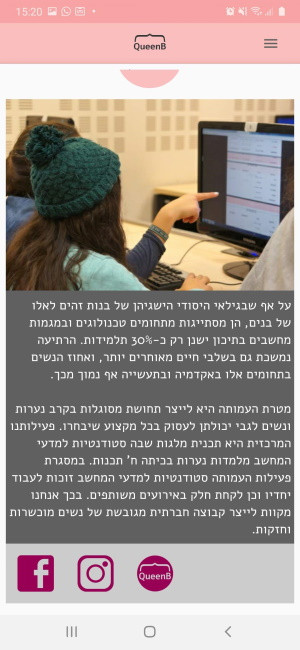

# Application for QueenB organziation

This app is written in Java for Android. It was done as a part of a voluntary project for Queenb organization. Its porpuse is to attract teeange girls to join programming Lessons.

## Contents

The app is constituted by 5 pages:

* Who are we page
explains about QueenB organization. has styles logo buttons to instagram, facebook and official site page.

* Trivia game
Trivia game which is intended to be a fun an interactive part of the app, that will attempts to pass on that computer science is exiting and that also women can.

