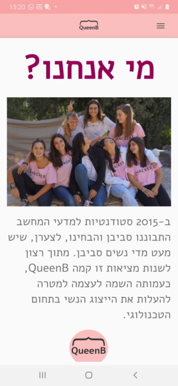
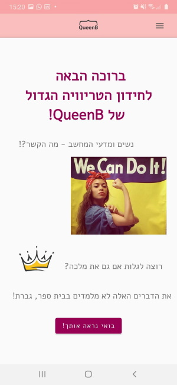
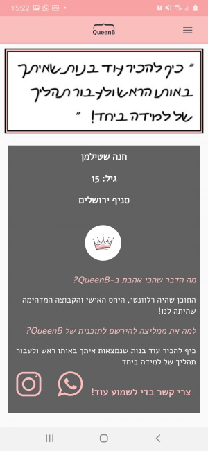

# Application for QueenB organziation

This app is written in Java for Android and designed using Material Design (Google). It was done as a part of a voluntary project for Queenb organization. Its porpuse is to attract teeange girls to join programming Lessons.

## Contents

The app is constituted by 5 pages: who are we, Trivia game, "QueenB embassy", projects and information and registration.

### Who are we page

explains about QueenB organization. has styles logo buttons to instagram, facebook and official site page.

### Trivia game

Trivia game which is intended to be a fun an interactive part of the app, that attempts to pass on that computer science is exciting and that women fits it great.

by pressing "start trivia", a series of light and funny questions apears. Here is one example:

Here is one more:

### "QueenB Embassy"

A list of girls that were participants of this program and recommend it.

By clicking on a girl's card, one can see what she replied to the questions and what she thought of it. Plus, it can click on Instagram logo to see who she is or to contact her directly using the whatsupp logo. This opens whatsup and places a suggested message that a shy girl can use to open a conversation.

### Projects

A list of links to web projects that were made by old participants of the program.

### Information and signup

One can choose a relevant place and inspect detail about activity in it.

By clicking on a specific place:

